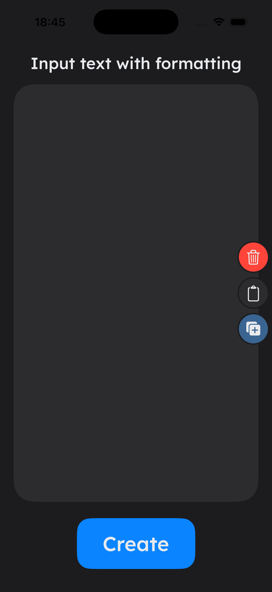
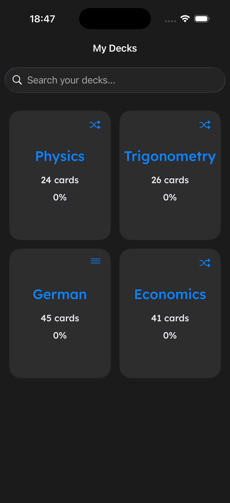
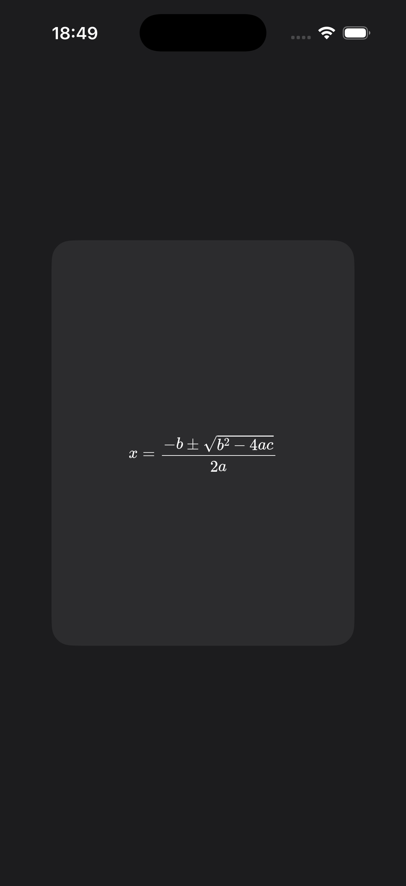

# MinimalFlashcards

A minimalist, gesture-driven flashcard study app built for speed and accuracy. No clutter, no distractions.

| Create Deck | Deck List | Flashcards |
| :---: | :---: | :---: |
|  |  |  |

<br>

## 🚀 Features

- STEM-Grade Rendering: Integration of a high-resolution LaTeX engine (MathJax) to display complex formulas, identities, and scientific equations with perfect clarity.

- Universal Input Parser: A streamlined, text-based deck creation system that uses a minimalist `CLUE:ANSWER,` format to turn raw notes into study sessions instantly.

- Tactile User Experience: Gesture-centric navigation including 3D-flip animations, spring-physics swipes, and synchronized haptic feedback via `UIImpactFeedbackGenerator`.

<br>

## 🛠️ Technical Implementation

- Hybrid UI Architecture: 100% SwiftUI layouts utilizing `UIViewRepresentable` to bridge a high-performance `WKWebView` for professional-grade math rendering.

- State Architecture: Centralized data flow using `@State` and `@Binding` to synchronize the deck parser and study progress across views.

- Input Sanitization & Parsing: Custom RegEx-based string logic that cleans raw data and handles the `CLUE:ANSWER,` delimiters to ensure consistent model creation from plain text.

<br>

## 🚀 Roadmap (What I'm Learning Next)
- [x] Gestural UX: 3D-flip mechanics, Spring-physics swipes, and Haptic integration.

- [x] Technical Rendering: LaTeX MathJax engine and WKWebView/SwiftUI bridging.

- [ ] Adaptive Logic: Implementation of "Re-learn" piles and SRS algorithms for long-term retention.

- [ ] Cloud & Visuals: iCloud persistence and native `img:` tag support for STEM diagrams.

<br>

## 📱 Installation
Clone the repository:

``` bash
git clone https://github.com/Heli4m/MinimalFlashcards.git
```

Open MinimalFlashcards.xcodeproj in Xcode.

Ensure you have the Lexend font files added to your project (or update your text views to use system fonts).

Build and run on an iPhone Simulator or physical device.

📄 License
This project is licensed under the MIT License - see the LICENSE file for details.

<br>

Author: Liam N. High School Student and Developer

[Github](https://github.com/Heli4m) | [Project Link](https://github.com/Heli4m/MinimalFlashcards)
